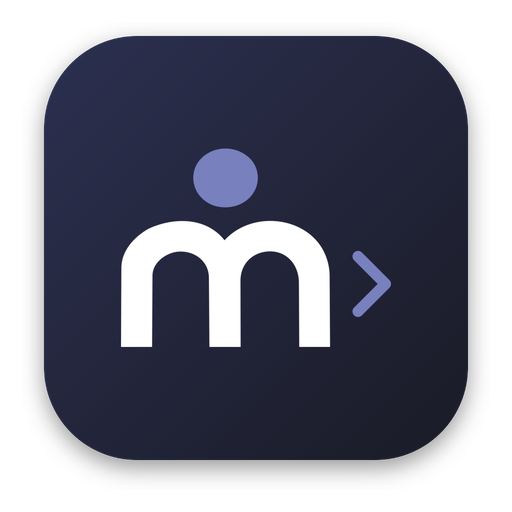

<table><tr>
<td><a href="https://maiterm.dev/"></a></td>
<td><h1><a href="https://maiterm.dev/">maiTerm</a></h1>A terminal built for AI workflows — not AI built into a terminal.<br><a href="https://maiterm.dev/">Documentation & Screenshots</a></td>
</tr></table>

A terminal emulator built with Tauri 2 + Svelte 5, designed to make terminal-based AI workflows better and more organized. maiTerm is not "AI in a terminal" — there is no built-in LLM, no chat sidebar, no magic autocomplete. Instead, it's a proper terminal that understands what AI coding agents are doing and gives you the tools to manage them.

Our initial focus is on **Claude Code** integrations:

- **Real-time session tracking** — hooks report Claude's state (active, idle, needs permission) with live tab indicators
- **Auto-resume** — automatically reconnects to your last Claude session when you open a tab, using hooks-captured session IDs
- **Tab state awareness** — know at a glance which tabs have Claude thinking (pulsing dot), waiting for input (green dot), or needing permission (lock icon)
- **Workspace organization** — group related Claude sessions by project; split panes to run multiple agents side by side
- **Scrollback persistence** — full terminal state in SQLite survives restarts, so you never lose Claude's output
- **SSH session cloning** — split into a second shell at the same remote CWD while Claude works in the first
- **IDE integration** — MCP server with 25+ tools for file operations, diff review, editor control, notes, and multi-agent coordination
- **SSH MCP bridge** — reverse SSH tunnel exposes local IDE tools to Claude Code running on remote servers

maiTerm is fully written by AI (Claude), with human engineering direction and architectural rails.

Runs on macOS, Windows, and Linux.

## Why maiTerm?

Other terminals give you tabs and splits. maiTerm gives you a system for managing the chaos of real AI-assisted development — where you're juggling multiple Claude sessions across projects, SSHing into servers, and trying to remember what you were doing three hours ago.

### Organize by workspace, not just tabs

Group your terminals by project. Each workspace has its own pane layout, tabs, and context. Switch between "ACME Project" and "Production Server" without losing your place in either.


### Notes on every tab

Each tab has its own markdown notes panel. Track TODOs, paste connection strings, jot down what you're debugging — right next to the terminal doing the work. Workspace-level notes too.


### Built-in editor, integrated with your terminal

Click any file path in terminal output to open it in an editor tab. Works over SSH too — remote files load transparently via SCP. Syntax highlighting for 50+ languages, image/PDF preview, and Claude Code's diff review all live alongside your terminal tabs.


### Deep clone everything

Duplicate a tab and get *everything*: scrollback history, CWD, SSH session, Claude resume command, tab name, notes, trigger variables. Or shallow clone for just the name and CWD. New tabs automatically inherit the workspace's most common working directory.

### Tab names that make sense

Tabs auto-update from terminal titles (OSC 0/2), but you can override with your own name — or combine both. Rename a tab "billing API debug" and it stays that way even as the terminal title changes underneath.

### Per-tab command history

Every tab maintains its own shell history. Clone a tab and its history comes with it. No more scrolling through one giant shared history trying to find the command you ran in a specific context.

### Auto-resume: never lose a session

Reboot your machine, restart maiTerm — everything comes back. Terminal scrollback, tab layout, workspace state. Claude Code sessions auto-resume using hooks-captured session IDs — no manual setup needed. SSH sessions reconnect to the right remote CWD. Pick up exactly where you left off.

### Archive and restore tabs

Done with a Claude session but not ready to lose it? Archive the tab. It disappears from your tab bar but preserves everything — scrollback, notes, trigger state. Restore it later and resume right where you left off. Perfect for when `/rename` and `--continue` aren't enough.

### Stay in the loop with notifications

Triggers watch your terminal output for patterns — Claude asking a question, a long build finishing, context compaction starting. Get notified via in-app toasts or OS notifications, with deep-linking straight to the right workspace and tab.

## Features

### Terminal
- **alacritty_terminal + xterm.js** — Rust-based VTE parser and buffer management with xterm.js as thin WebGL renderer (~60fps ANSI frames)
- **Split panes** — horizontal and vertical splits, drag to resize, fully recursive
- **Multiple workspaces** — named workspaces with independent pane layouts, reorderable via drag and drop
- **Workspace suspend/resume** — suspend idle workspaces to free resources, auto-suspend after configurable timeout
- **Lazy terminal activation** — PTYs only spawn when a tab becomes visible
- **Multiple tabs** — per-pane tabs with activity indicators and completion detection
- **Scrollback persistence** — SQLite (WAL mode) with dirty tracking and staggered saves
- **SSH session cloning** — split an SSH session to get a second shell at the same remote CWD
- **Multi-window** — open additional windows, duplicate windows with full tab context

### Shell Integration
- **OSC 133 (FinalTerm)** — command start/finish detection for tab completion indicators
- **OSC 7** — directory tracking (remote CWD awareness through SSH)
- **OSC 8 file hyperlinks** — `l` command wraps `ls` to emit clickable file links; underline appears on hover
- **`l` shell function** — always available in local shells; also injectable into remote shells via context menu
- **Tab indicators** — completed (checkmark/cross), at-prompt (›), and activity dot; no spinner (interactive programs stay stable)
- **Remote install** — one-liner session setup or permanent `~/.bashrc`/`~/.zshrc` installation

### Code Editor
- **CodeMirror 6** — full-featured editor in tabs alongside terminal tabs
- **Click to open** — click any file path in terminal output to open it in an editor tab
- **`Cmd+O`** — file dialog that defaults to the active terminal's CWD
- **Local + remote files** — remote files read/written via SCP, transparent to the user
- **Diff review** — side-by-side diff tabs with accept/reject workflow (used by Claude Code integration)
- **Image preview** — PNG, JPG, GIF, WebP, SVG, AVIF, BMP, ICO with zoom controls (fit, +/-, presets)
- **50+ languages** — syntax highlighting via CodeMirror 6 first-class packages and legacy StreamLanguage modes
- **Language detection** — by extension, known filename (`.bashrc`, `Dockerfile`), and shebang line
- **Find/replace** — `Cmd+F`, positioned at top of editor
- **Save** — `Cmd+S` writes local or remote via SCP; dirty indicator in tab
- **Close protection** — inline confirm (no `window.confirm`) for unsaved changes
- **Portal pattern** — editor survives split tree changes (same as terminals)

### Claude Code IDE Integration
- **MCP server** — WebSocket, SSE, and Streamable HTTP transports expose 25+ tools to Claude Code CLI
- **Hooks integration** — HTTP lifecycle hooks (SessionStart/End, PreToolUse/PostToolUse, Stop, Notification, PreCompact) provide real-time session state tracking
- **Tab indicators** — pulsing accent dot (Claude active/thinking), green dot (idle/waiting for input), lock icon (needs permission)
- **Auto-resume** — hooks capture session IDs automatically; tabs resume Claude sessions on restart
- **Diff review** — Claude proposes file changes; you accept or reject in a side-by-side diff tab
- **Notes & workspace tools** — per-tab notes, workspace notes, note search, notes panel control via MCP
- **Multi-agent coordination** — `getClaudeSessions` exposes all active Claude sessions (state, tool, model, cwd) across tabs
- **SSH MCP bridge** — reverse SSH tunnel (`-R 0:localhost:port`) exposes local IDE tools to remote Claude Code; ControlMaster mux support, bridge status indicator
- **Auto-discovery** — writes lock file to `~/.claude/ide/` and registers in `~/.claude.json` for automatic connection
- **Dev/prod isolation** — dev builds register as `aiterm-dev` with display name "maiTermDev"

### Trigger System
- **Regex triggers** — watch terminal output for patterns, fire actions
- **Match modes** — regex, plain text, or variable-condition expressions
- **Actions** — `notify` (toast or OS notification), `send_command` (write to PTY), `enable_auto_resume`, `set_tab_state`
- **Variables** — capture groups mapped to named variables (`%varName`), persisted per tab
- **Variable interpolation** — used in tab titles, auto-resume commands, notification bodies
- **Variable conditions** — expression parser supporting `&&`, `||`, `!`, `==`, `!=` operators
- **Custom triggers** — Claude-specific triggers replaced by hooks; trigger engine available for user-defined patterns

### Notifications
- **Three modes** — `auto` (in-app when focused, OS when not), `in_app`, `native`, `disabled`
- **Deep-linking** — clicking a toast or OS notification navigates to the source workspace and tab
- **Toast UI** — max 3 visible, configurable auto-dismiss duration, Tokyo Night styled
- **Sound alerts** — built-in chirp or system sounds with configurable volume
- **Command completion** — notifies when long-running commands finish (configurable minimum duration)

### Notes
- **Per-tab notes** — markdown or plain text notes panel per terminal/editor tab
- **Workspace notes** — notes scoped to the whole workspace
- **Interactive checkboxes** — rendered in preview mode
- **Modes** — edit and preview; state persisted per tab

### Themes
- **10 built-in themes** — Tokyo Night (default), Dracula, Solarized Dark, Solarized Light, Nord, Gruvbox Dark, Monokai, Catppuccin Mocha, One Dark, macOS Pro
- **Custom themes** — create and edit via theme editor in preferences
- **Separate UI and terminal colors** — full control over both

### Workspace Sidebar
- **Sort order** — default (drag and drop), alphabetical, or recent activity
- **Tab count** — optional display of tab count after workspace names
- **Recent workspaces** — collapsible section, toggleable

## Keyboard Shortcuts

| Shortcut | Action |
|----------|--------|
| `Cmd+T` | New tab |
| `Cmd+W` | Close tab (or pane if last tab) |
| `Cmd+1–9` | Switch to tab |
| `Cmd+Shift+[` | Previous tab |
| `Cmd+Shift+]` | Next tab |
| `Cmd+Shift+T` | Duplicate tab |
| `Cmd+Shift+R` | Reload tab (duplicate + close) |
| `Cmd+D` | Split pane (duplicate tab) |
| `Cmd+N` | New workspace |
| `Cmd+O` | Open file in editor tab |
| `Cmd+S` | Save file (editor tabs) |
| `Cmd+F` | Find/replace (editor tabs) |
| `Cmd+,` | Preferences |
| `Cmd+/` | Help |
| `Cmd+Shift+N` | Notes panel toggle |

## Prerequisites

All platforms require:
- [Node.js](https://nodejs.org/) 18+
- [Rust](https://rustup.rs/)

### macOS
- macOS 13+
- Xcode Command Line Tools (`xcode-select --install`)

### Windows
- Windows 10/11
- [Visual Studio Build Tools](https://visualstudio.microsoft.com/visual-cpp-build-tools/) — select "Desktop development with C++" workload
- [WebView2](https://developer.microsoft.com/en-us/microsoft-edge/webview2/) (pre-installed on Windows 10/11; bundled by the NSIS installer for end users)

### Linux
- WebKitGTK 4.1, GTK 3, libayatana-appindicator3 (see [Tauri Linux prerequisites](https://v2.tauri.app/start/prerequisites/#linux))

## Development

```bash
# Install dependencies
npm install

# Full app dev (frontend + Rust backend + MCP bridge)
npm run tauri:dev

# Frontend only (no Tauri)
npm run dev

# Type checking
npm run check

# Rust compilation check (run from src-tauri/)
cargo check
```

## Building

```bash
npm run tauri:build
```

Build output by platform:

| Platform | Format | Output path |
|----------|--------|-------------|
| macOS | DMG | `src-tauri/target/release/bundle/dmg/` |
| Windows | NSIS installer | `src-tauri/target/release/bundle/nsis/` |
| Linux | .deb | `src-tauri/target/release/bundle/deb/` |

### macOS post-build

After building on macOS, set the DMG volume icon:

```bash
./scripts/set-dmg-icon.sh
```

### CI

GitHub Actions workflows build automatically on push to `main` and on tags:
- `.github/workflows/build-linux.yml` — Ubuntu, produces `.deb`
- `.github/workflows/build-windows.yml` — Windows, produces NSIS `.exe` installer

## Project Structure

```
src/                          # Frontend (Svelte 5 / TypeScript)
├── routes/
│   ├── +layout.svelte        # App shell, keyboard shortcuts, modals
│   └── +page.svelte          # Main terminal/editor view, portal rendering
└── lib/
    ├── components/
    │   ├── editor/           # EditorPane, DiffPane (CodeMirror 6)
    │   ├── terminal/         # TerminalPane, TerminalTabs
    │   ├── workspace/        # WorkspaceSidebar
    │   └── pane/             # SplitPane
    ├── stores/               # Svelte 5 runes stores
    │   ├── workspaces.svelte.ts
    │   ├── terminals.svelte.ts
    │   ├── preferences.svelte.ts
    │   ├── triggers.svelte.ts
    │   ├── activity.svelte.ts
    │   ├── claudeCode.svelte.ts    # Claude Code IDE tool handler
    │   ├── claudeState.svelte.ts   # Claude session state from hooks
    │   ├── sshMcpBridge.svelte.ts  # SSH MCP bridge orchestration
    │   ├── editorRegistry.svelte.ts # Editor state tracking
    │   ├── notifications.svelte.ts  # Command completion notifications
    │   ├── toasts.svelte.ts
    │   └── notificationDispatch.ts
    ├── triggers/
    │   ├── defaults.ts       # Trigger defaults (empty — Claude triggers replaced by hooks)
    │   └── variableCondition.ts  # Variable expression parser
    ├── themes/
    │   └── index.ts          # Theme definitions + application
    ├── utils/
    │   ├── editorTheme.ts    # Tokyo Night CodeMirror theme
    │   ├── filePathDetector.ts  # xterm.js link provider
    │   ├── languageDetect.ts    # Extension → language + CM6 loader
    │   ├── openFile.ts          # Orchestrates file open flow
    │   ├── shellIntegration.ts  # Remote shell hook snippets
    │   ├── promptPattern.ts     # PS1-like pattern matching
    │   ├── platform.ts          # OS detection, modifier key helpers
    │   └── ansi.ts              # ANSI escape stripping
    └── tauri/
        ├── commands.ts       # invoke() wrappers
        └── types.ts          # TypeScript interfaces

src-tauri/src/                # Backend (Rust)
├── lib.rs                    # App setup, command registration
├── commands/
│   ├── workspace.rs          # State CRUD
│   ├── editor.rs             # File read/write, SCP, editor tab creation
│   ├── terminal.rs           # PTY spawn/write/resize/kill
│   ├── window.rs             # Multi-window management
│   └── claude_code.rs        # Claude Code tool response handler
├── claude_code/              # Claude Code IDE integration
│   ├── server.rs             # WebSocket + SSE + Streamable HTTP MCP server
│   ├── protocol.rs           # JSON-RPC protocol, tool definitions
│   └── lockfile.rs           # Lock file, MCP registration, hook settings
├── terminal/                 # Terminal backend (alacritty_terminal)
│   ├── handle.rs             # TerminalHandle, VTE processor
│   ├── render.rs             # Grid → ANSI viewport renderer (~60fps)
│   ├── osc.rs                # OscInterceptor (OSC 7/9/133/633/1337)
│   ├── search.rs             # Buffer search via RegexSearch
│   └── serialize.rs          # Buffer serialization/restore
├── state/
│   ├── workspace.rs          # Data structures
│   ├── app_state.rs          # Global state container
│   └── persistence.rs        # JSON file storage
└── pty/
    └── manager.rs            # PTY management, shell integration injection
```

## Tech Stack

| Layer | Technology |
|-------|-----------|
| Frontend | Svelte 5 (runes), SvelteKit, TypeScript |
| Backend | Rust, Tauri 2 |
| Terminal | alacritty_terminal (Rust VTE parser + buffer) with xterm.js as thin WebGL renderer |
| Editor | CodeMirror 6 (+ MergeView for diffs) |
| PTY | portable-pty |
| Scrollback | SQLite (WAL mode) via rusqlite |
| State | parking_lot RwLock |

## Data Model

```
Workspace
├── id, name
├── panes: Pane[]
├── active_pane_id
├── split_root: SplitNode (binary tree)
└── notes: WorkspaceNote[]

Pane
├── id, name
├── tabs: Tab[]           # terminal, editor, or diff tabs
└── active_tab_id

Tab
├── id, name, custom_name
├── tab_type: 'terminal' | 'editor' | 'diff'
├── pty_id                # terminal tabs
├── editor_file           # editor tabs (path, remote info, language)
├── diff_context          # diff tabs (request_id, file_path, old/new content)
├── scrollback
├── notes, notes_open, notes_mode
└── trigger_variables

Trigger
├── pattern (regex), match_mode (regex/plain_text/variable)
├── actions, variables
├── enabled, cooldown, workspaces scope
└── default_id            # links to built-in template

Preferences
├── theme, custom_themes
├── font_size, font_family, cursor_style, cursor_blink
├── clone_*, notification_mode, shell_integration
├── notification_sound, notification_volume, toast_duration
├── prompt_patterns, triggers
├── claude_code_ide, claude_code_ide_ssh
└── workspace sidebar options
```

## Theme

Default: Tokyo Night. 10 built-in themes + custom theme support.

```css
--bg-dark:   #1a1b26   /* main background */
--bg-medium: #24283b   /* elevated surfaces */
--bg-light:  #414868   /* borders, hover */
--fg:        #c0caf5   /* primary text */
--fg-dim:    #565f89   /* secondary text */
--accent:    #7aa2f7   /* interactive elements */
```

## Privacy

maiTerm checks for updates on launch and hourly while running. Those checks pass
through `updates.maiterm.dev`, which counts them so we can estimate how many
people use maiTerm.

What's counted is deliberately minimal and anonymous:

- **No** IP address, hostname, username, cookie, or device identifier is stored.
- To turn the hourly checks into a unique-users-per-day figure without keeping
  any identifier, the count uses the [Plausible](https://plausible.io/data-policy)
  approach: a one-way hash of `daily_secret_salt + IP + user-agent`. The salt is
  random, rotates every day, and is discarded — so a hash can't be reversed to an
  IP or linked across days.
- Only the date, app version, and OS/arch are retained, in aggregate.

**Opt out:** disable **Preferences → Updates → Automatically check for updates**.
No update check means no ping, and nothing is counted.

The counter is a small Cloudflare Worker; its full source is in
[`update-worker/`](update-worker/).
